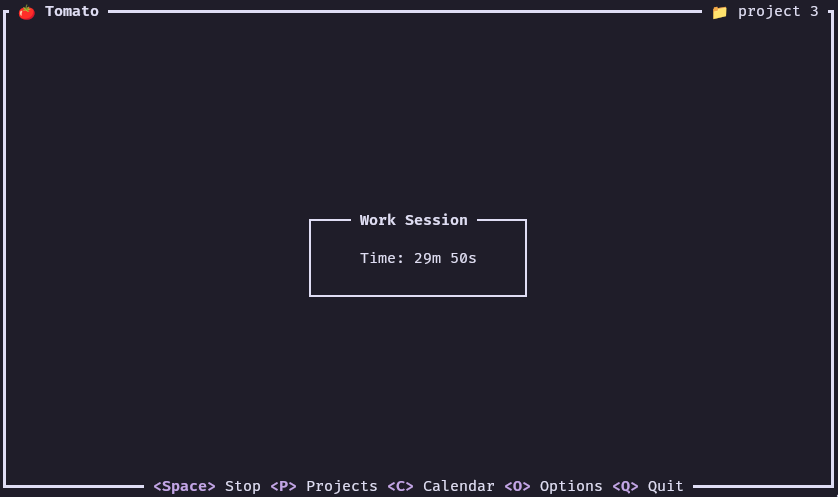
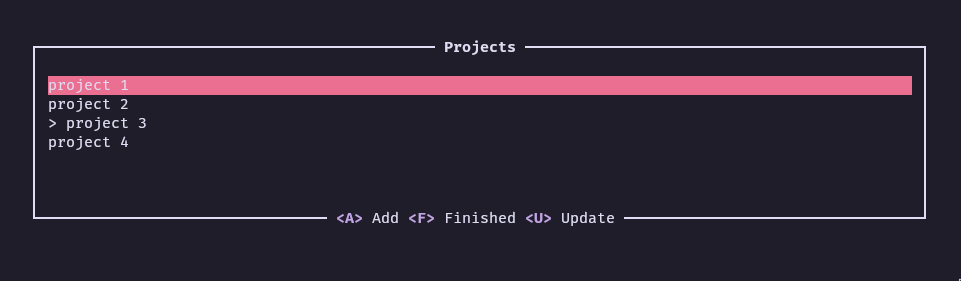
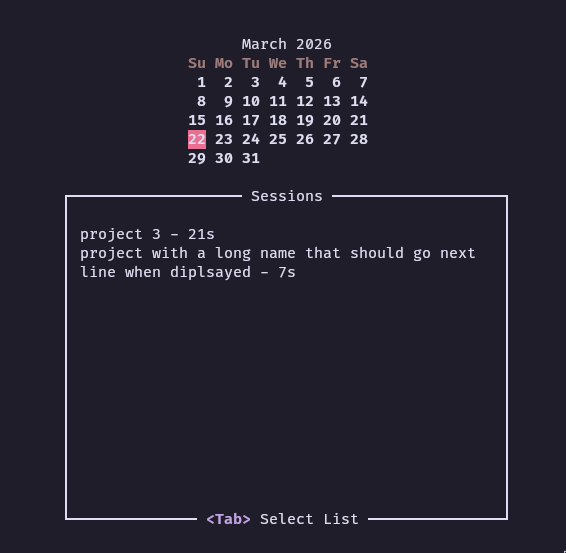
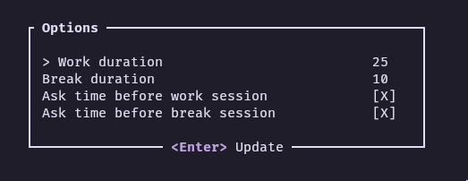

# Tomato 

Tomato is a simple pomodoro TUI written in Rust. 

<p align="center">
    
</p>

Designed to be flexible allowing you to choose if you need a break or not in order to respect your flow state. 

## Features

### Projects

You can add projects and track time you spend on them every day.

<p align="center">
    
</p>

The selected project is visible at the top right corner of the TUI you can of course have nothing selected.

<p align="center">
    
</p>

### Calendar

You can go through the calendar and see how much time you spent on your projects.

<p align="center">
    
</p>

### Options

You can configure:
- Default work time. 
- Default break time.
- Whether you want to be able to choose work time before session.
- Whether you want to be able to choose break time before session.

<p align="center">
    
</p>

## Install

You can get the binary directly from each release or build from source:

```bash
cargo build --release
```

### Nix users

```nix
{
  pkgs,
  lib,
}:
pkgs.rustPlatform.buildRustPackage rec {
  pname = "tomato";
  version = "v1.1.0";
  src = pkgs.fetchFromGitHub {
    owner = "ValJed";
    repo = pname;
    rev = version;
    hash = "sha256-0a8RRqIHsgorY+esUGf4h76JbFDM7EO9XzTGe3/jaa4=";
  };
  cargoHash = "sha256-Gyb6lxnamfsL7X+KHRlDKhSKIJ/UaPe5Rlfd7VvItk0=";
  meta = {
    description = "Task manager";
    homepage = "https://github.com/ValJed/tomato";
    license = lib.licenses.unlicense;
    maintainers = [];
  };
}
```

## Default config

At first startup it'll create a config file located in `~/.config/tomato/config.toml` with db_location.
:warning: you need to delete the old db file if you change this value.

```toml
db_location = '/home/$USER/.local/share/tomato/tomato.sqlite'
```
